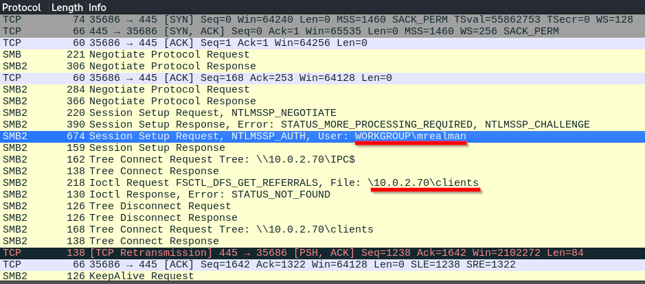
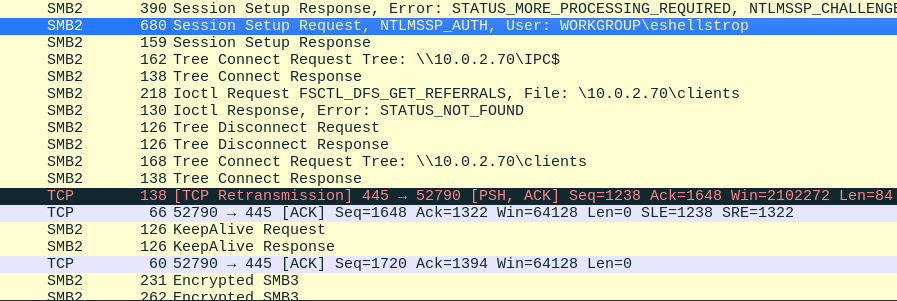
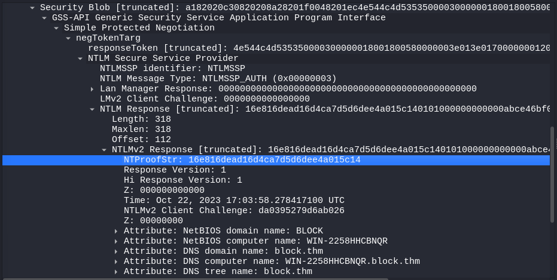
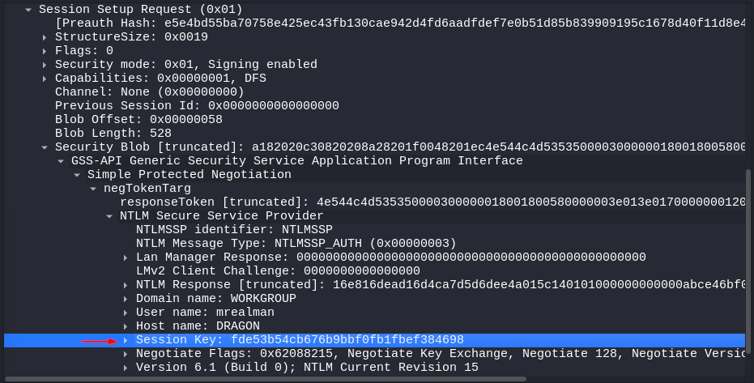
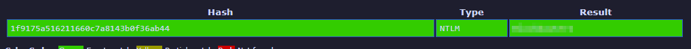
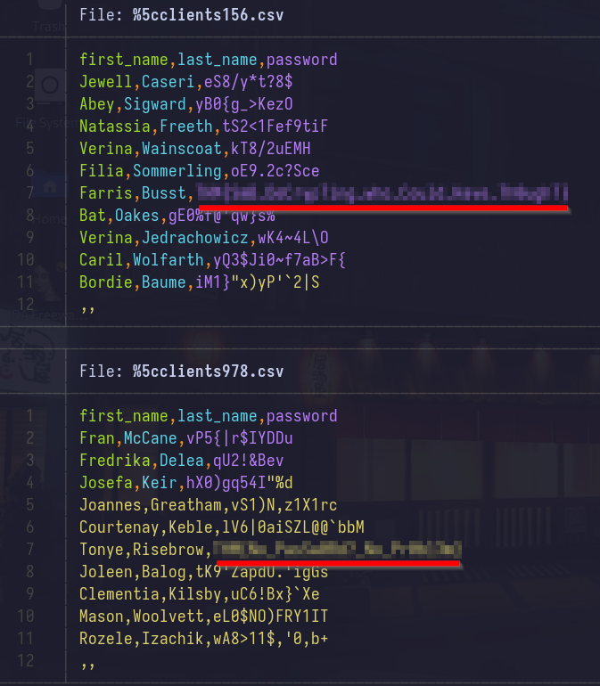

---
title: Block
date: <i class="fa-solid fa-calendar"></i> Creation date:<span style='opacity:0;'>_</span>13.08.2024
keywords:
- Block
- Block Writeup
- Write-Up
- TryHackMe
- thm
- Aleksander Jóźwik
...

<main>

<div class="card summary">
<h4>Summary</h4>
<hr>
<b><i class="fa-solid fa-box"></i> Source:</b> <a href='https://tryhackme.com/r/room/blockroom'>TryHackMe <i class="fa-solid fa-arrow-up-right-from-square"></i></a><br>
<b><i class="fa-solid fa-signal"></i> Difficulty:</b> <span class="medium-diff">Medium</span><br>
</span>
</div>

<div class="card">
<h4>Description</h4>
<hr>
One of your junior system administrators forgot to deactivate two accounts from a pair of recently fired employees.
We believe these employees used the credentials they were given in order to access some of the many private files from our server, but we need concrete proof.
The junior system administrator only has a small network capture of the incident and a memory dump of the Local Security Authority Subsystem Service process.
Fortunately, for your company, that is all you need.

</span>
</div>

Upon extracting the archive we can see 2 files: **lsass.DMP** and **traffic.pcapng**; 

**DMP** file is a memory dump, that is data from RAM that is written to a storage drive. Specificly lsass.dmp is memory of [**LSASS process**](https://en.wikipedia.org/wiki/Local_Security_Authority_Subsystem_Service){target="_blank"}, which means we might be able to find credentials in there.

**PCAPNG** file contains captured network packets, which can be viewed in **Wireshark** (or other software like **tcpdump** or **tshark**).

# Investigating the PCAP file

Let's first take a look at **traffic.pcapng**. 


As we can see there is some **SMB2 traffic**. Let's look at the **info column**.


We can see that user *mrealman* connected to **SMB server** and among others accessed *\\10.0.2.70\\clients* file.
We will further see encrypted SMB3 packets, which means unfortunately we can't extract the files user has accessed.

<div class="card">
<h4>Q1. What is the username of the first person who accessed our server?</h4>
<hr>
**Answer:** mrealman
</span>
</div>

<div class="card">
<h4>Q4. What is the username of the second person who accessed our server?</h4>
<hr>
**Answer:** eshellstrop
</span>
</div>


Further into the capture we can see another user trying to connect to the server - **eshellstrop**.

In order to decrypt the traffic, we need decrypted session key, which we will generate using a Python script below: (you can also find it [here](https://github.com/jozwikaleksander/smb-sessionkey-gen){target="_blank"}). 

```python
#!/usr/bin/env python3
# -*- coding: utf-8 -*-

"""
+----------------------------------------------------------+
| ----------- Random SMB2 Session Key Generator ---------- |
|                                                          |
|  Author:          Aleksander Jóźwik (@jozwikaleksander)  |
|  Creation date:   10-08-2024                             |
|                                                          |                     
+----------------------------------------------------------+
"""
import hashlib
import hmac
import argparse
import logging
from binascii import unhexlify, hexlify
from Cryptodome.Cipher import ARC4

# Configure logging
logging.basicConfig(level=logging.INFO, format='%(levelname)s: %(message)s')


def generate_ntlm_hash(password=None, nt_hash=None):
    """
    Generate NTLM hash from the provided password or return the existing NT hash.

    :param password: User's password (string)
    :param nt_hash: NT hash (string in hex)
    :return: NTLM hash in bytes
    """
    if nt_hash:
        return unhexlify(nt_hash)
    if password:
        return hashlib.new('md4', password.encode('utf-16le')).digest()
    raise ValueError("You need to provide either a password or an NT hash.")


def calculate_response_nt_key(ntlmHash, user, domain):
    """
    Calculate the ResponseNTKey using the NTLM hash, user, and domain.

    :param ntlmHash: NTLM hash in bytes
    :param user: Upper-cased user name in bytes (UTF-16LE encoded)
    :param domain: Upper-cased domain name in bytes (UTF-16LE encoded)
    :return: ResponseNTKey in bytes
    """
    hmac_md5 = hmac.new(ntlmHash, digestmod=hashlib.md5)
    hmac_md5.update(user + domain)
    return hmac_md5.digest()


def calculate_key_exchange_key(responseNtKey, ntProofStr):
    """
    Calculate the KeyExchangeKey using the ResponseNTKey and NTProofStr.

    :param responseNtKey: ResponseNTKey in bytes
    :param ntProofStr: NTProofStr in bytes (hex decoded)
    :return: KeyExchangeKey in bytes
    """
    hmac_md5 = hmac.new(responseNtKey, digestmod=hashlib.md5)
    hmac_md5.update(ntProofStr)
    return hmac_md5.digest()


def decrypt_session_key(keyExchangeKey, encrypted_key):
    """
    Decrypt the session key using RC4 and the KeyExchangeKey.

    :param keyExchangeKey: KeyExchangeKey in bytes
    :param encrypted_key: Encrypted session key in bytes (hex decoded)
    :return: Decrypted session key in bytes
    """
    rc4 = ARC4.new(keyExchangeKey)
    return rc4.encrypt(encrypted_key)


def parse_arguments():
    """
    Parse command-line arguments.
    
    :return: Parsed arguments
    """
    parser = argparse.ArgumentParser(prog='SMB Session Key Generator', description='Generates random decrypted SMB2 session key')
    
    # Required Arguments
    parser.add_argument('-u', '--user', required=True, help="User name")
    parser.add_argument('-d', '--domain', required=True, help="Domain name")
    parser.add_argument('-n', '--ntproofstr', required=True, help="NTProofStr (hex encoded)")
    parser.add_argument('-k', '--key', required=True, help="Encrypted Session Key (hex encoded)")
    
    # Optional Arguments
    parser.add_argument('-p', '--password', help="User's password")
    parser.add_argument('--ntHash', help="NT hash in hex")
    parser.add_argument('-v', '--verbose', action='store_true', help="Increase output verbosity")
    
    return parser.parse_args()


def main():
    args = parse_arguments()

    # Transforming user and domain to uppercase and converting to bytes
    user = args.user.upper().encode('utf-16le')
    domain = args.domain.upper().encode('utf-16le')

    try:
        # Generating an NTLM hash and converting it to bytes
        ntlmHash = generate_ntlm_hash(password=args.password, nt_hash=args.ntHash)

        # Generating ResponseNTKey
        responseNtKey = calculate_response_nt_key(ntlmHash, user, domain)

        # Converting NTPROOFSTR to bytes
        ntProofStr = unhexlify(args.ntproofstr)

        # Calculating KeyExchangeKey using NTPROOFSTR and ResponseNTKey
        keyExchangeKey = calculate_key_exchange_key(responseNtKey, ntProofStr)

        # Generating decrypted session key
        sessionKey = decrypt_session_key(keyExchangeKey, unhexlify(args.key))
    except Exception as e:
        logging.error(f"An error occurred: {e}")
        return

    # Output results
    if args.verbose:
        logging.info(f"Username: {args.user.upper()}")
        logging.info(f"Domain: {args.domain.upper()}")
        if args.password:
            logging.info(f"Password: {args.password}")
        if args.ntHash:
            logging.info(f"NT hash: {args.ntHash}")
        logging.info(f"Ntproofstr: {args.ntproofstr}")
        logging.info(f"Session key: {args.key}")
        logging.info(f"Random generated session key: {hexlify(sessionKey).decode()}")
    else:
        print(hexlify(sessionKey).decode())


if __name__ == '__main__':
    main()
```

**For quick installation:**

    git clone https://github.com/jozwikaleksander/smb-sessionkey-gen.git
    cd smb-sessionkey-gen
    pip3 install -r requirements.txt

**To use this script we will need following information:**

- Username
- Domain
- Password (or NT hash)
- Ntproofstr
- Encrypted session key

## What is Ntproofstr?
Out of the list above one parameter stands out - **Ntproofstr**. One of the protocols used
to authenticate in **SMB** is [NTLM](https://en.wikipedia.org/wiki/NTLM){target="_blank"} (NT LAN Manager). It's a [challenge-response protocol](https://en.wikipedia.org/wiki/Challenge%E2%80%93response_authentication){target="_blank"}, which means server responds to client's initial request with **CHALLENGE_MESSAGE** (used to establish the identity of the client), to which client responds with an **AUTHENTICATE_MESSAGE**.

Part of the **AUTHENTICATE_MESSAGE** in **NTLMv2** is **NtProofStr**, which is generated by hashing the **NT hash** (hash of the password), **server challenge** and additional data (such as timestamp and random numbers).

## How to find Ntproofstr?

Let's go back to our PCAP file in Wireshark. We will have to do some digging to find the string we are interested in.
First select the **Session Setup Request** packet.


Next go to **SMB2 > Session Setup Request > Security Blob > GSS-API > Simple Protected Negotiation > negTokenTarg > NTLM Secure Service Provider > NTLM Response > NTLMv2 Response > NTProofStr**, then click the right mouse button on it, choose *Copy > ... as a Hex Stream*.



In our case **NTProofStr** for **mrealman** is *16e816dead16d4ca7d5d6dee4a015c14*.
For the **eshellstrop** it's *0ca6227a4f00b9654a48908c4801a0ac*.

## Finding encrypted session key

As we are already digging in our PCAP file, let's find session key. It should be already visible when we navigated to NTProofStr. Nonetheless here is the full path: **SMB2 > Session Setup Request > Security Blob > GSS-API > Simple Protected Negotiation > negTokenTarg > NTLM Secure Service Provider > Session Key**.



**Encrypted Session Key** for *mrealman*: *fde53b54cb676b9bbf0fb1fbef384698*;
**Encrypted Session Key** for *eshellstrop*: *c24f5102a22d286336aac2dfa4dc2e04*;

You might wonder why are why trying to generate session key if we can find one in the PCAP file, the difference is this one is encrypted, we need one that is decrypted 😅.

## Finding the session id
That one is easier, go to **SMB2 > SMB2 Header > Session Id**, click on it with right mouse button and press **Copy > ... as a Hex Stream**.


**Session ID** for *mrealman*: 4100000000100000 <br>
**Session ID** for *eshellstrop*: 4500000000100000

## Script Explanation

I will explain the Python script step by step, if you are not interested [skip this part](#reading-the-dmp-file).

### Transforming username and domain to uppercase, next converting it to bytes.

```python
user = args.user.upper().encode('utf-16le')
domain = args.domain.upper().encode('utf-16le')
```

### Generating NTLM hash using MD4 hash function if needed

```python
def generate_ntlm_hash(password=None, nt_hash=None):
    """
    Generate NTLM hash from the provided password or return the existing NT hash.

    :param password: User's password (string)
    :param nt_hash: NT hash (string in hex)
    :return: NTLM hash in bytes
    """
    if nt_hash:
        return unhexlify(nt_hash)
    if password:
        return hashlib.new('md4', password.encode('utf-16le')).digest()
    raise ValueError("You need to provide either a password or an NT hash.")
```

### Next we are calculating Response NT Key

**ResponseNTKey** is an intermediate value, generated using NTLM hash and concatenation of username and domainname. It's done using [HMAC-MD5](https://learn.microsoft.com/en-us/dotnet/api/system.security.cryptography.hmacmd5?view=net-8.0), where the NTLMv2 hash serves as the key and the concatenated username and domain are the data being hashed., where the NTLMv2 hash serves as the key and the concatenated username and domain are the data being hashed.

```python
def calculate_response_nt_key(ntlmHash, user, domain):
    """
    Calculate the ResponseNTKey using the NTLM hash, user, and domain.

    :param ntlmHash: NTLM hash in bytes
    :param user: Upper-cased user name in bytes (UTF-16LE encoded)
    :param domain: Upper-cased domain name in bytes (UTF-16LE encoded)
    :return: ResponseNTKey in bytes
    """
    hmac_md5 = hmac.new(ntlmHash, digestmod=hashlib.md5)
    hmac_md5.update(user + domain)
    return hmac_md5.digest()
```

### Generating KeyExchangeKey
**KeyExchangeKey** is used to encrypt or decrypt the session key that will be used to secure communication. It is calculated by combining [ResponseNTKey](#next-we-are-calculating-response-nt-key) and [NTProofStr](#what-is-ntproofstr).
Again it's created using [HMAC-MD5](https://learn.microsoft.com/en-us/dotnet/api/system.security.cryptography.hmacmd5?view=net-8.0) hash.

```python
def calculate_key_exchange_key(responseNtKey, ntProofStr):
    """
    Calculate the KeyExchangeKey using the ResponseNTKey and NTProofStr.

    :param responseNtKey: ResponseNTKey in bytes
    :param ntProofStr: NTProofStr in bytes (hex decoded)
    :return: KeyExchangeKey in bytes
    """
    hmac_md5 = hmac.new(responseNtKey, digestmod=hashlib.md5)
    hmac_md5.update(ntProofStr)
    return hmac_md5.digest()
```

### Decrypting session key
With the help of the key we created in last step, we can decrypt the session key using [RC4](https://pl.wikipedia.org/wiki/RC4). [RC4](https://pl.wikipedia.org/wiki/RC4) is a stream cipher, so it's using the same operation ([XOR](https://pl.wikipedia.org/wiki/RC4)) for encrypting and decrypting, that's why we are using **rc4.encrypt** function in the code below.

```python
def decrypt_session_key(keyExchangeKey, encrypted_key):
    """
    Decrypt the session key using RC4 and the KeyExchangeKey.

    :param keyExchangeKey: KeyExchangeKey in bytes
    :param encrypted_key: Encrypted session key in bytes (hex decoded)
    :return: Decrypted session key in bytes
    """
    rc4 = ARC4.new(keyExchangeKey)
    return rc4.encrypt(encrypted_key)
```

# Reading the DMP file

Next we will need a **user's password**. For that we will look at the **lsass.DMP file**.
In order to read it we will use **pypykatz tool**, which is installed on Kali Linux by default. We will use the following command:

    pypykatz lsa minidump lsass.DMP

## Pypykatz output

I will only show important parts of the output as it's pretty long.

    [...]

    username mrealman
    domainname BLOCK
    logon_server WIN-2258HHCBNQR
    logon_time 2023-10-22T16:53:54.168637+00:00
    sid S-1-5-21-3761843758-2185005375-3584081457-1104
    luid 1883004
            == MSV ==
                    Username: mrealman
                    Domain: BLOCK
                    LM: NA
                    NT: 1f9175a516211660c7a8143b0f36ab44
                    SHA1: ccd27b4bf489ffda2251897ef86fdb488f248aef
                    DPAPI: 3d618a1fffd6c879cd0b056910ec0c31

    [...]

    username eshellstrop
    domainname BLOCK
    logon_server WIN-2258HHCBNQR
    logon_time 2023-10-22T16:46:09.215626+00:00
    sid S-1-5-21-3761843758-2185005375-3584081457-1103
    luid 828825
            == MSV ==
                    Username: eshellstrop
                    Domain: BLOCK
                    LM: NA
                    NT: 3f29138a04aadc19214e9c04028bf381
                    SHA1: 91374e6e58d7b523376e3b1eb04ae5440e678717
                    DPAPI: 87c8e56bc4714d4c5659f254771559a8
    
    [...]

As we can see there are **NT hashes** for our user (*mrealman*) and other user - *eshellstrop* (to which we will come later).
We won't need passwords in plaintext for the script itself, but we need the first user's password to answer a question. To crack the hash we will use an online tool called [CrackStation](https://crackstation.net/){target="_blank"}.

Navigate to the site, paste the hash and press **Crack Hashes**.



<div class="card">
<h4>Q5. What is the hash of the user in question 4?</h4>
<hr>
**Answer:** 3f29138a04aadc19214e9c04028bf381
</span>
</div>

# Generating decrypted session key
We've gathered all data we need to run the script. To sum up here is the data for the first user - **mrealman** and the second user (as the process is exactly the same I won't show it) **eshellstrop**.

<div class="card">
<h4>First user's parameters</h4>
<hr>

- **Username:** mrealman
- **Domain** (found in a PCAP file, not the one in DMP): WORKGROUP
- **NTProofStr:** 16e816dead16d4ca7d5d6dee4a015c14
- **Encrypted Session key:** fde53b54cb676b9bbf0fb1fbef384698
- **NT Hash:** 1f9175a516211660c7a8143b0f36ab44

</span>
</div>

**Command:**

    python3 smb-key-gen.py -u mrealman -d workgroup --ntHash 1f9175a516211660c7a8143b0f36ab44 -n 16e816dead16d4ca7d5d6dee4a015c14 -k fde53b54cb676b9bbf0fb1fbef384698

**Output:**

    20a642c086ef74eee26277bf1d0cff8c

<div class="card">
<h4>Second user's parameters</h4>
<hr>

- **Username:** eshellstrop
- **Domain** (found in a PCAP file, not the one in DMP): WORKGROUP
- **NT Hash:** 3f29138a04aadc19214e9c04028bf381
- **NTProofStr:** 0ca6227a4f00b9654a48908c4801a0ac
- **Encrypted Session key:** c24f5102a22d286336aac2dfa4dc2e04

</span>
</div>

**Command:**

    python3 smb-key-gen.py -u eshellstrop -d WORKGROUP --ntHash 3f29138a04aadc19214e9c04028bf381 -n 0ca6227a4f00b9654a48908c4801a0ac -k c24f5102a22d286336aac2dfa4dc2e04

**Output:**

    facfbdf010d00aa2574c7c41201099e8

# Decrypting traffic
 


In order to decrypt the traffic, select any SMB2 packet choose **Protocol Preferences > SMB2 > Secret session keys for decryption**.


Fill in data we gathered earlier, and press OK.

## Exporting SMB objects

To export files from the PCAP file, go to **File > Export Objects > SMB...**;


As you can see we've got two file ready to be exported, select **Save all** and choose the path.

Navigate to chosen directory and read the files.



</main>

# Summary
This was a really cool box! It helped me get a better grasp on how SMB and NTLM work, and I had a lot of fun figuring out the solution. 
I’m excited to find more boxes like this in the future.