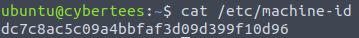
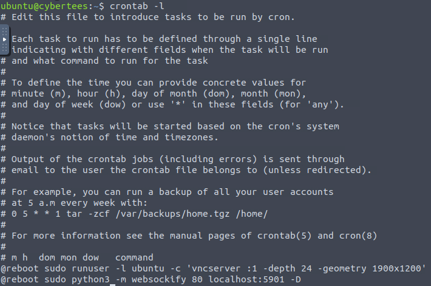
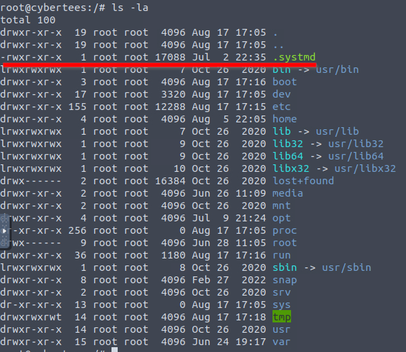
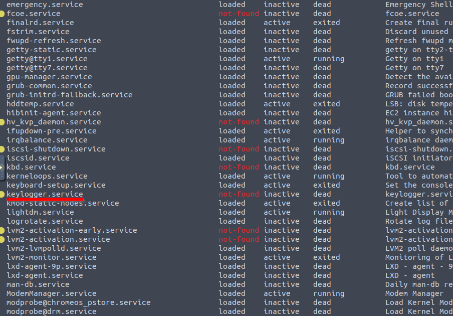
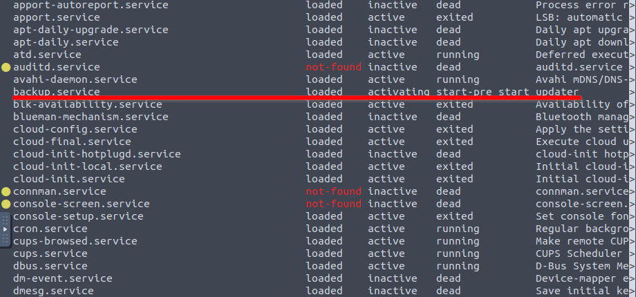
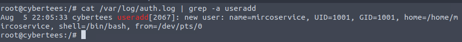
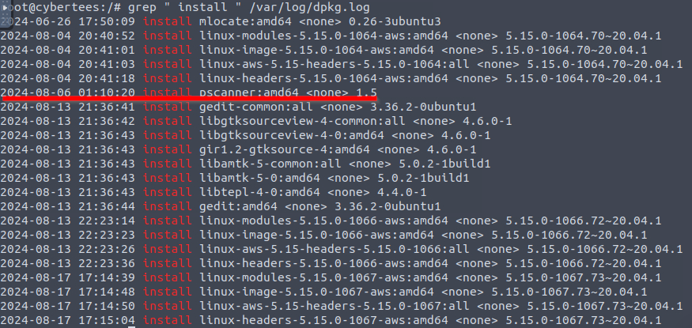
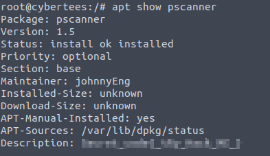

---
title: Iron Shade
date: <i class="fa-solid fa-calendar"></i> Creation date:<span style='opacity:0;'>_</span>17.08.2024
keywords:
- Iron Shade
- Iron Shade Write-Up
- Iron Shade Writeup
- Writeup
- Writeups
- ctf
- Capture The Flag
- TryHackMe
- thm
...

<main>

<div class="card summary">
<h4>Summary</h4>
<hr>
<b><i class="fa-solid fa-box"></i> Source:</b> <a href='https://tryhackme.com/r/room/ironshade'>TryHackMe <i class="fa-solid fa-arrow-up-right-from-square"></i></a><br>
<b><i class="fa-solid fa-signal"></i> Difficulty:</b> <span class="medium-diff">Medium</span><br>
</div>

<div class="card">
<h4>Incident Scenario</h4>
<hr>
Based on the threat intel report received, an infamous hacking group, IronShade, has been observed targeting Linux servers across the region. Our team had set up a honeypot and exposed weak SSH and ports to get attacked by the APT group and understand their attack patterns. <br><br>

You are provided with one of the compromised Linux servers. Your task as a Security Analyst is to perform a thorough compromise assessment on the Linux server and identify the attack footprints. Some threat reports indicate that one indicator of their attack is creating a backdoor account for persistence.
</div>

<div class="card">
<h4>Challenge</h4>
<hr>
Investigate the server and identify the footprints left behind after the exploitation.
</div>

# What is the Machine ID of the machine we are investigating?
**Machine ID** - value set during installation or boot. It uniquely identifies the host and should be considered confidential. It's written in */etc/machine-id*.



# What backdoor user account was created on the server?
To list all accounts we can examine the **/etc/passwd** file.

```bash
$ cat /etc/passwd
[Output ommited...]
mircoservice:x:1001:1001:,,,:/home/mircoservice:/bin/bash
```
The last user in the file was *mircoservice*.

# What is the cronjob that was set up by the attacker for persistence?
In order to list cronjobs we can look at **/etc/crontab** or use **crontab -l**.


```
@reboot /home/mircoservice/printer_app
```

Our job is listed on the bottom, **@reboot** signifies that it will be run on each reboot.


# Examine the running processes on the machine. Can you identify the suspicious-looking hidden process from the backdoor account?
We can use **ps aux**, to see running process, additionally we can filter for phrase *"mircoservice"* using **grep**.

```bash
ubuntu@cybertees:~$ ps aux | grep mircoservice
root         570  0.0  0.0   2364   580 ?        Ss   17:05   0:00 /home/mircoservice/.tmp/.strokes
root         876  0.0  0.0   2496    68 ?        S    17:05   0:00 /home/mircoservice/printer_app
ubuntu     10294  0.0  0.0   3444   724 pts/0    S+   17:15   0:00 grep --color=auto mircoservice
```
As we can see there is one process that is hidden using the *"."*, that's **.strokes**.

# How many processes are found to be running from the backdoor account’s directory?

We can use the results of the last command to answer this question, remember not to count the **grep** command 😅.

# What is the name of the hidden file in memory from the root directory?

This can be simply done using **ls -la**.

There is one file - **.systmd**;

# What suspicious services were installed on the server? Format is service a, service b in alphabetical order.

In order to search the services we can use:
```bash
systemctl list-unit-files --type=service
```
After some digging we can find two weird services.




Those are **backup.service** and **strokes.service**;

# Examine the logs; when was the backdoor account created on this infected system?



As a reminder **/var/log/auth.log** is the **Authorization Log** and contains information about **authorization mechanisms**, **user names** and usage of **sudo**. 
I will list below what more can we see in this file:

- login attempts (successful and failed)
- data about network services
- actions that require elevated privileges

In order to filter logs we can use **grep** with an **-a** switch (because grep treats auth.log as a binary file) for the *useradd command*.
The **timestamp** is the first thing we can read: *Aug 5 22:05:33*;

# From which IP address were multiple SSH connections observed against the suspicious backdoor account?

As I said before *auth.log* will contain network services information such as **SSH connections**. We will again use **grep** and search for *ssh*, we can grab the first
event to find the IP address: *10.11.75.247*;

```bash
$ cat /var/log/auth.log | grep -a ssh
[ Output omitted... ]
Aug 13 22:16:12 cybertees sshd[2388]: PAM 2 more authentication failures; logname= uid=0 euid=0 tty=ssh ruser= rhost=10.11.75.247  user=mircoservice
[ Output omitted...]
```

# How many failed SSH login attempts were observed on the backdoor account?

```bash
root@cybertees:/# cat /var/log/auth.log | grep -a "ssh" | grep -a "mircoservice" | grep -a "Fail"
Aug  6 01:16:43 cybertees sshd[2256]: Failed password for mircoservice from 10.11.75.247 port 54649 ssh2
Aug  6 01:17:14 cybertees sshd[2256]: Failed password for mircoservice from 10.11.75.247 port 54649 ssh2
Aug 13 22:15:08 cybertees sshd[2385]: Failed password for mircoservice from 10.11.75.247 port 64855 ssh2
Aug 13 22:15:16 cybertees sshd[2385]: message repeated 2 times: [ Failed password for mircoservice from 10.11.75.247 port 64855 ssh2]
Aug 13 22:15:44 cybertees sshd[2388]: Failed password for mircoservice from 10.11.75.247 port 64871 ssh2
Aug 13 22:16:12 cybertees sshd[2388]: message repeated 2 times: [ Failed password for mircoservice from 10.11.75.247 port 64871 ssh2]
```
We can **chain multiple grep** commands to find the proper logs. There were *8 failed SSH login attempts.*

# Which malicious package was installed on the host?



We can search for installation of packages using */var/log/dpkg.log* and filter for *"install"* keyword using **grep**.
One package seems out of the ordinary: **pscanner**.

# What is the secret code found in the metadata of the suspicious package?



To view the details of a package we can use **apt show**; Our flag is written in the *package's description*.

# Summary
This challenge required us to thoroughly examine several system components, including system logs, cron jobs, and the file structure, to uncover signs of malicious activity. We also investigated running services and application packages to identify any unauthorized or compromised elements introduced during the exploitation.
</main>